

    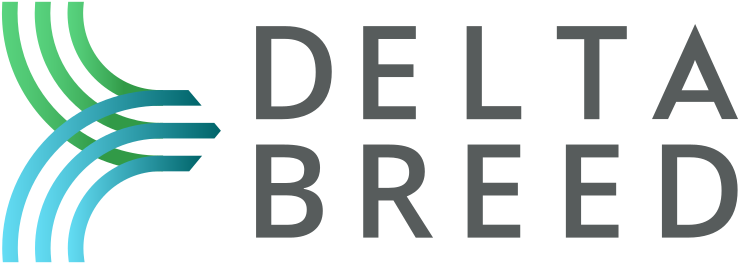

<h1 align="center">
    DeltaBreed
</h1>

<h2 align="center">
    Open source data management software for specialty crop and animal breeders.
</h2>

<h4 align="center">
    Developed by <a href="https://breedinginsight.org/">Breeding Insight</a> with funding from the U.S. Department of Agriculture (USDA) <a href="https://www.ars.usda.gov/">Agricultural Research Service (ARS)</a> through <a href="https://www.cornell.edu/">Cornell University</a>.
</h4>

____

  <a href="https://sandbox.breedinginsight.net/">Public Sandbox</a> |
  <a href="https://breedinginsight.atlassian.net/wiki/x/I4AlZ">User Manual</a> |
  <a href="#screenshots">Screenshots</a> |
  <a href="https://github.com/Breeding-Insight/bi-docker-stack">Running DeltaBreed</a> |
  <a href="https://breedinginsight.org/contact-us/">Contact Us</a>

## Try DeltaBreed

The easiest way to try DeltaBreed is to use [our public sandbox](https://sandbox.breedinginsight.net/). The User Manual, which describes how to use DeltaBreed's features, may be viewed [here](https://breedinginsight.atlassian.net/wiki/x/I4AlZ).

> Please note: 
>    - All submitted data are public; do not submit private data on the public sandbox.
>    - The public sandbox database is routinely reset and submitted data may be removed without notice.

## Source Code

 DeltaBreed consists of several components. Our Java backend is [Breeding-Insight/bi-api](https://github.com/Breeding-Insight/bi-api), our Vue frontend is [Breeding-Insight/bi-web](https://github.com/Breeding-Insight/bi-web), and the easiest way to run the app is with our docker compose configurations, [Breeding-Insight/bi-docker-stack](https://github.com/Breeding-Insight/bi-docker-stack). Additional repositories that DeltaBreed depends on include our Java BrAPI client, [Breeding-Insight/brapi](https://github.com/Breeding-Insight/brapi), our fork of the BrAPI Java Server, [Breeding-Insight/brapi-Java-TestServer](https://github.com/Breeding-Insight/brapi-Java-TestServer), and our browser-based test automation framework, [Breeding-Insight/taf](https://github.com/Breeding-Insight/taf).

## Screenshots

> View the [User Manual](https://breedinginsight.atlassian.net/wiki/x/I4AlZ) for more screenshots and detailed descriptions of DeltaBreed's features.

### [Germplasm Management](https://breedinginsight.atlassian.net/wiki/x/Y4I1jQ)

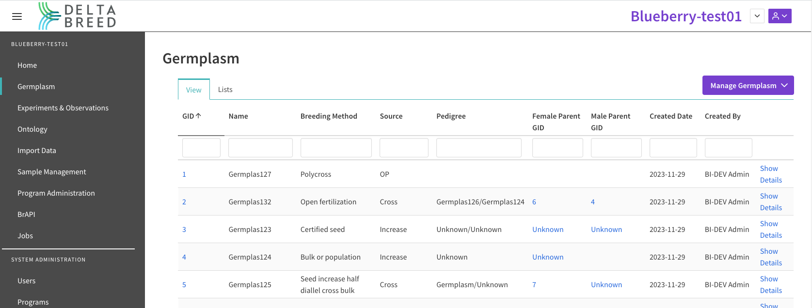

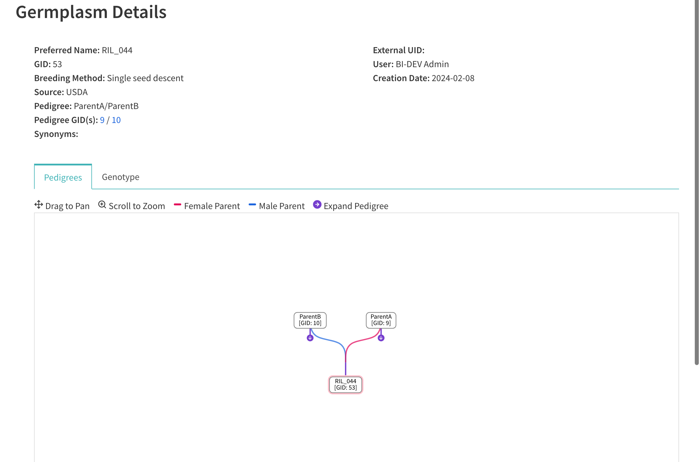

### [Ontology Management](https://breedinginsight.atlassian.net/wiki/x/2YM1jQ)

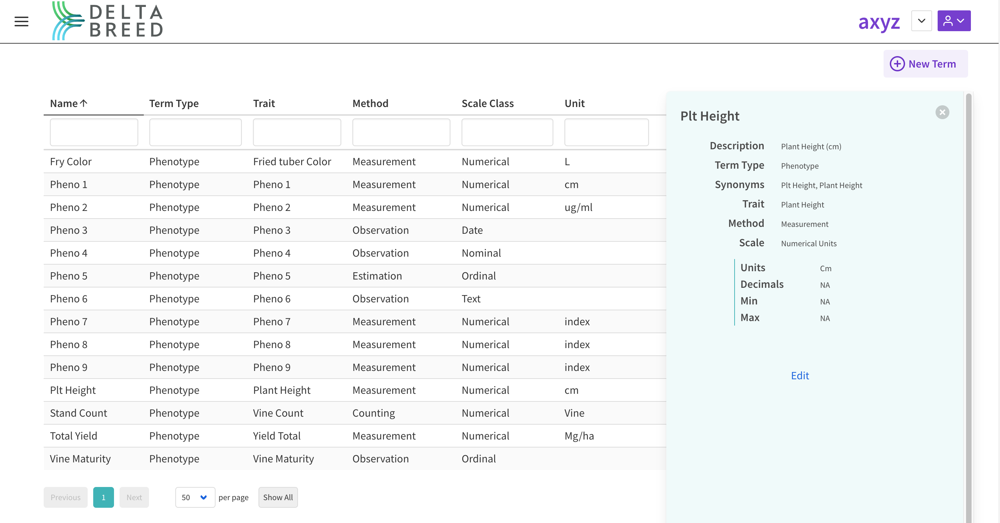

### [Experiments & Observations](https://breedinginsight.atlassian.net/wiki/x/xIQ1jQ)

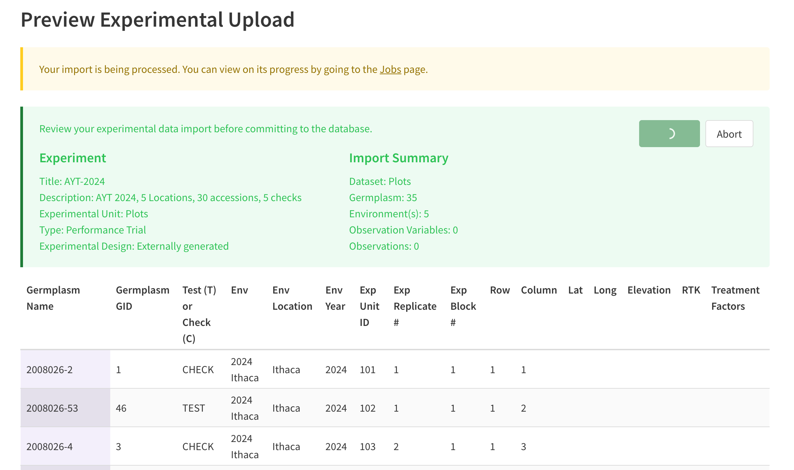

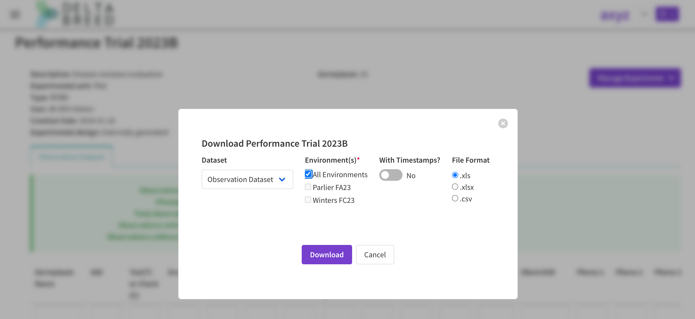

### [Genotypic Data Management (Beta)](https://breedinginsight.atlassian.net/wiki/x/04U1jQ)

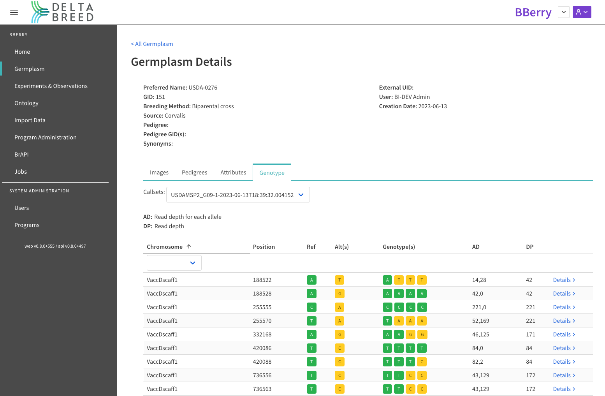

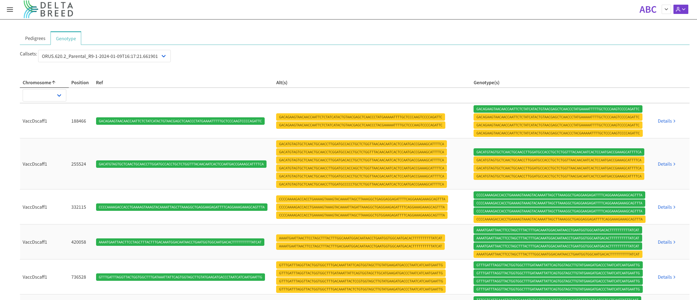

### [Sample Management](https://breedinginsight.atlassian.net/wiki/x/ToY1jQ)

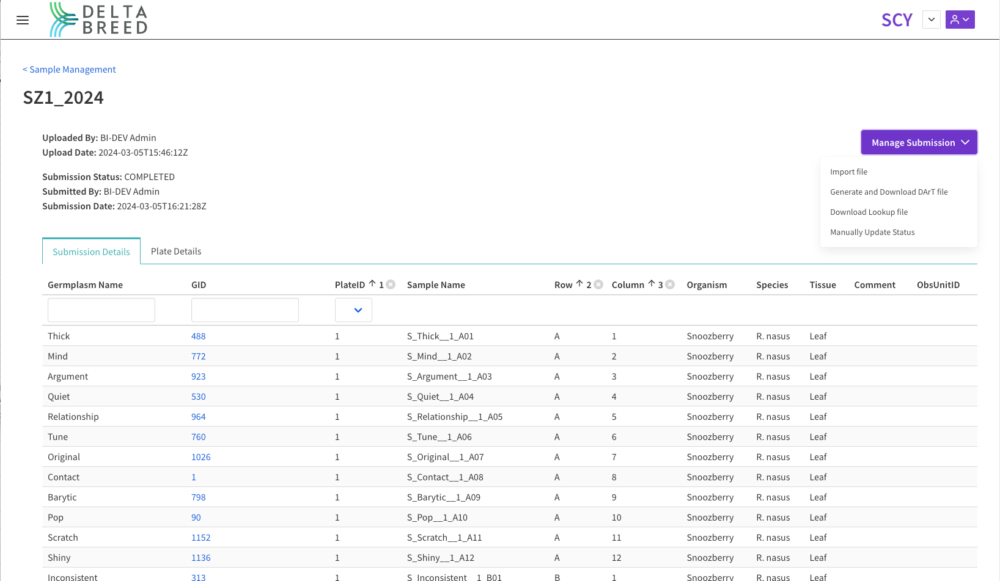

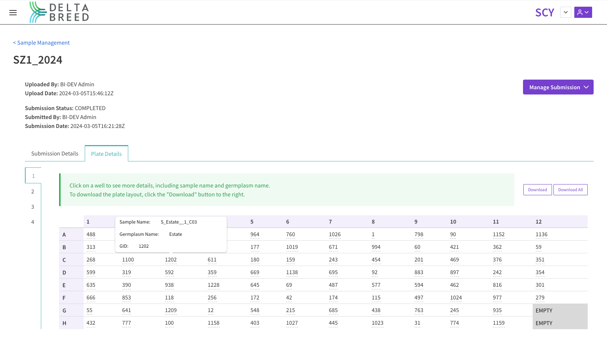

### [BrAPI Integration](https://breedinginsight.atlassian.net/wiki/x/2oY1jQ)

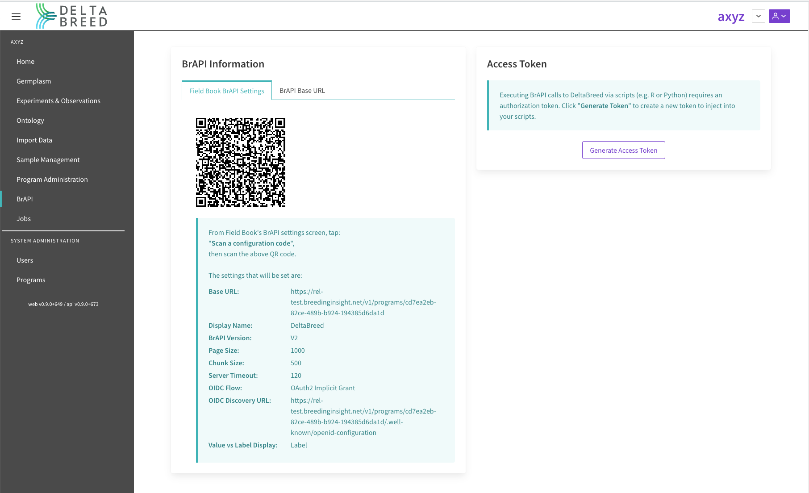

____

    
    
    

